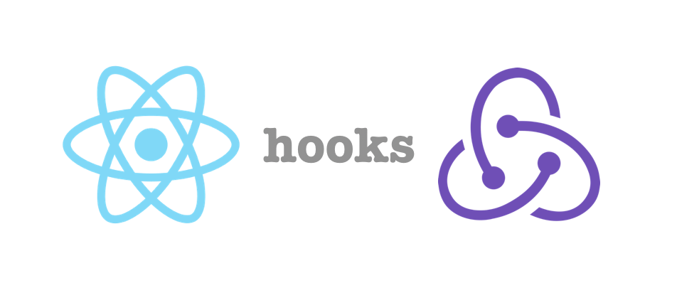

# Home1800


  This project was built from three different repositories [RealEstate_Server](https://github.com/estherkimyunjung/RealEstate_Server), [RealEstate_NodeServer](https://github.com/estherkimyunjung/RealEstate_NodeServer), and [RealEstate_Client](https://github.com/estherkimyunjung/RealEstate_Client). Then it was merged into [Home1800][1] to simplify cloning and updating the project.

  

</br>

>
> *This application build with*
>
  > - **Back-end**
  >>  **Ruby on Rails**  - *endpoints for users (client and agent), companies, properties, and appointments*
  >>  **Node.js** - *Nodemailer for email and Socket.IO for chat server*
>
  > - **Front-end**
  >>  **React**, **Redux**, and **Hooks** - *JWT authentication to manage user logins. Google Maps API to show the location and provide additional information to the property listings*
>
  > - **UI framework**
  >>  **Material UI**,  **Semantic UI**, and  **React-Bootstrap**
>
  
</br>

## Usage Guide

  ### Initial Setup

  1. Fork and clone this repository to your local machine.
  2. CD into the directory where you cloned.
  3. `cd server/` then setup the environments `bundle install`, `rails db:migrate`, `rails db:seed`, and `rails s` to start the server.
  4. open another terminal for node server `cd node_server/` Type `npm install` then run the node server by `npm start`.
  5. open last terminal for client, move into the client directory by `cd client/` and type `npm install` to setup the dependencies then start the react app by `npm start`.
  6. Now you are available to see in your browser URL: http://localhost:3001/login for Login (ID: est123 Password:es12345) or Sign Up for new account.

  ### Demo ###
  [](https://www.flickr.com/photos/beaurogers/31833779864/in/photolist-Qv3rFw-34mt9F-a9Cmfy-5Ha3Zi-9msKdv-o3hgjr-hWpUte-4WMsJ1-KUQ8N-deshUb-vssBD-6CQci6-8AFCiD-zsJWT-nNfsgB-dPDwZJ-bn9JGn-5HtSXY-6CUhAL-a4UTXB-ugPum-KUPSo-fBLNm-6CUmpy-4WMsc9-8a7D3T-83KJev-6CQ2bK-nNusHJ-a78rQH-nw3NvT-7aq2qf-8wwBso-3nNceh-ugSKP-4mh4kh-bbeeqH-a7biME-q3PtTf-brFpgb-cg38zw-bXMZc-nJPELD-f58Lmo-bXMYG-bz8AAi-bxNtNT-bXMYi-bXMY6-bXMYv)

  ### Google API Setup ###
  The creat a folder under /client/src `mkdir api` then move into api directory to creat the file `touch keys.js`

  ```
  Home1800/client/src/api/keys.js


  export default {
    API_KEY: `<Your google API key>`
  };
  ```

## Models Relationship Diagram


## Agile / SCRUM Workflow 
Use Mind Map Tool for brainstorming , several other tools for UI designs and Demo ,and Trello for schedule and workflow control
https://trello.com/b/S1LHYgSf/home-1800-esther

[Home1800][1]

[1]: <https://github.com/estherkimyunjung/Home1800> "Home1800"
